# Suburbia Skateboards

```
🛹 使用 Next.js 15、GSAP、Prismic、Three.js、Tailwind 和 TypeScript 构建 3D 滑板官网！
```

## 特性

本项目将为虚构滑板品牌 Suburbia Skateboards 搭建精美交互官网。

- [x] 🔌 [Next.js 15 (App Router)](https://nextjs.org)
- [x] 🎰 [React 19](https://react.dev)
- [x] 💡 [TypeScript](https://typescriptlang.org)
- [x] 🎨 [Tailwind CSS](https://tailwindcss.com)
- [x] 🧩 [Prismic (CMS)](https://prismic.io/)
- [x] ✨ [GSAP (animation)](https://gsap.com/docs/)
- [x] 🪅 [matter-js (2D)](http://brm.io/matter-js/)
- [x] 📸 [Three.js (React))](https://github.com/pmndrs/react-three-fiber)
- [x] 📦 [Netlify (deploy)](https://www.netlify.com/)

使用 Next.js 15、Tailwind CSS 和 Prismic，将Three.js集成到React中实现3D交互效果，最终托管在 Netlify 上。

## Notes

### 使用 Prismic

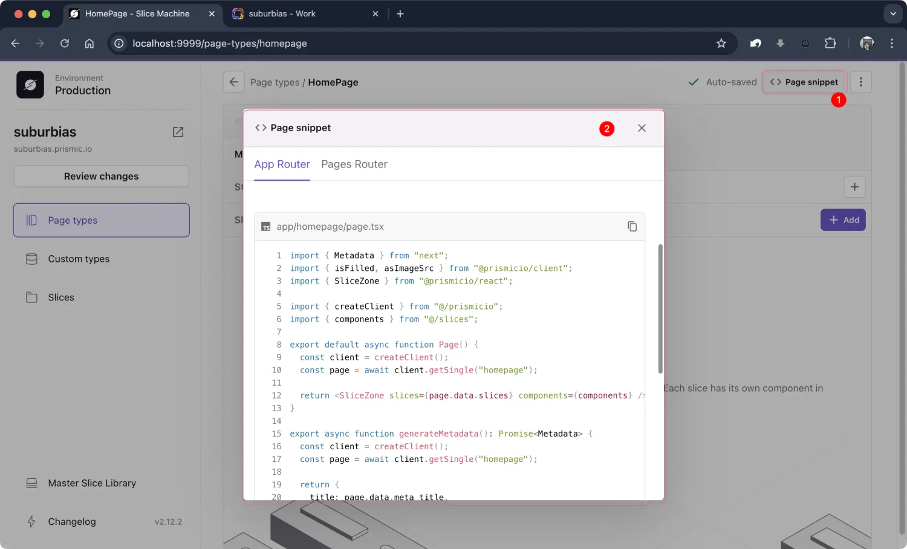

<br/>

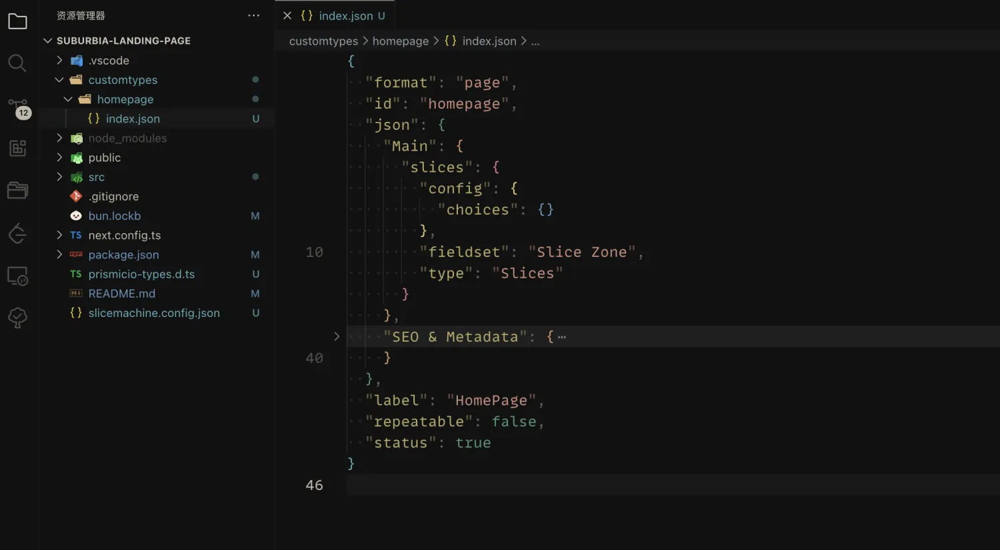

<br/>

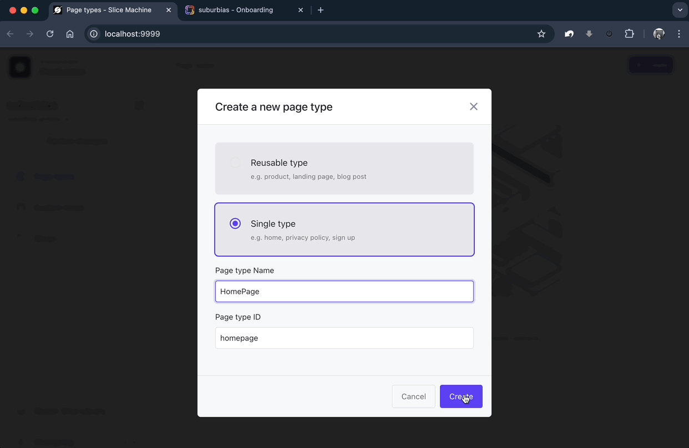

<br/>

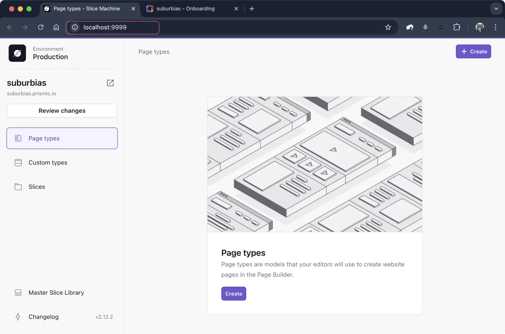

<br/>

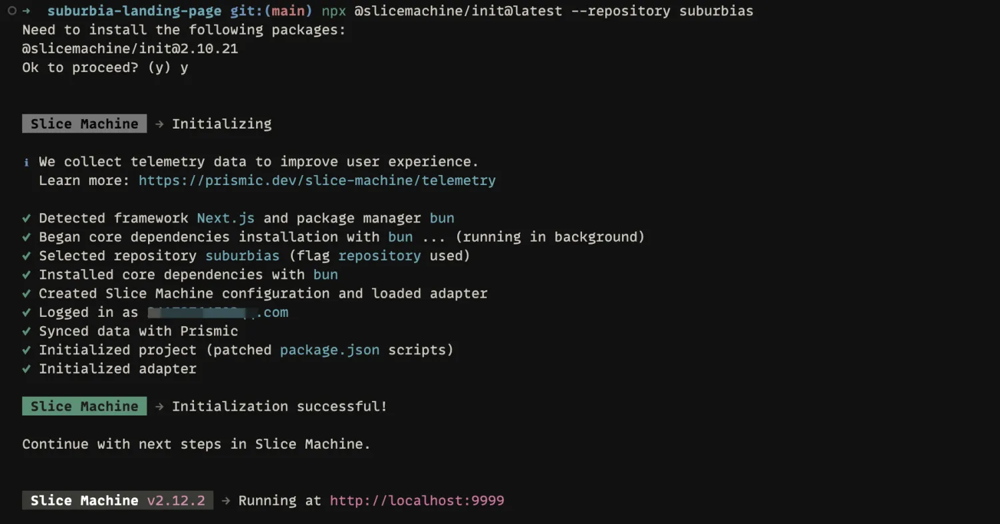

<br/>

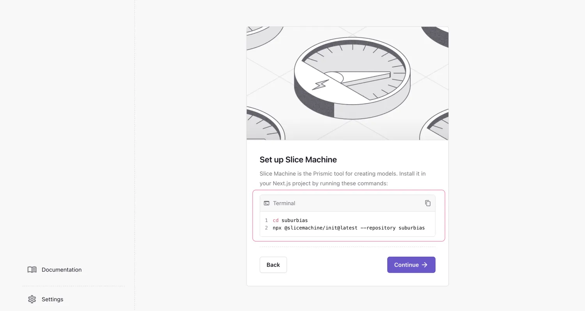

<br/>

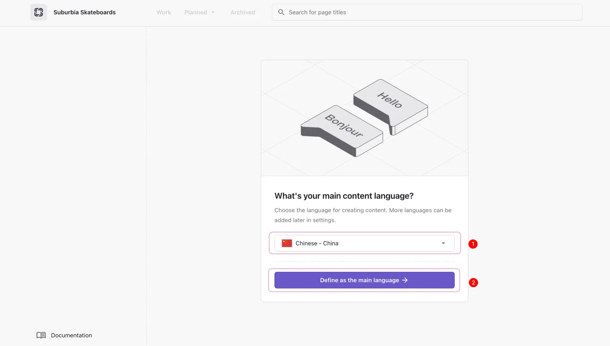

<br/>

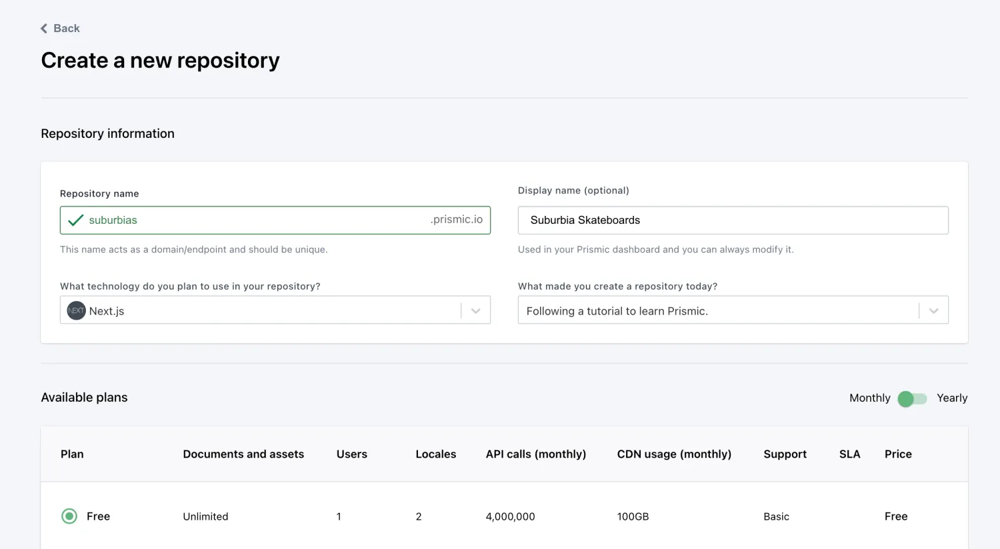

<br/>

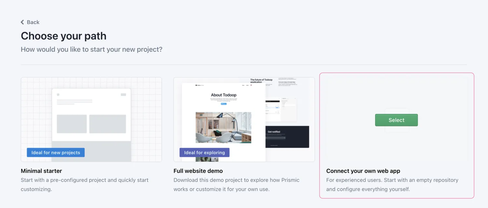

<br/>

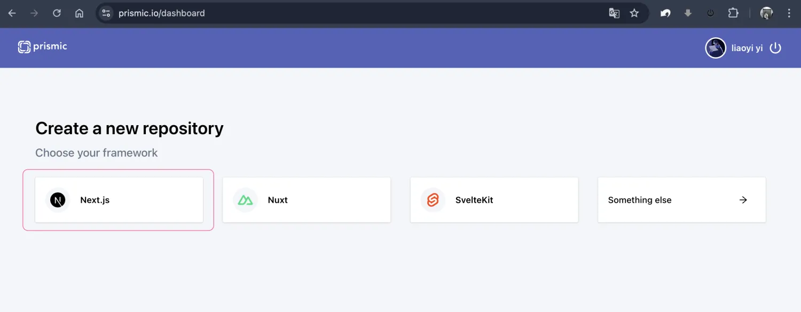

<br/>

### 创建 Hero

#### 1. 切片新增字段：

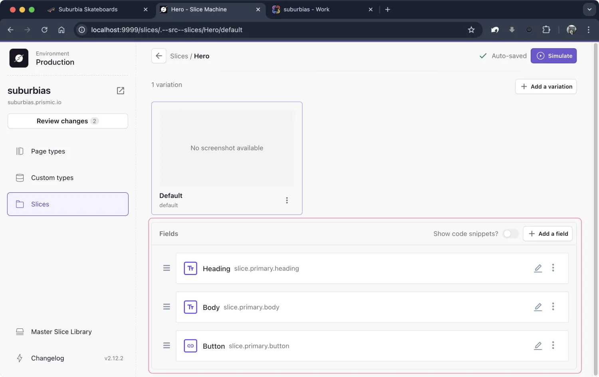

#### 2. 在页面使用：

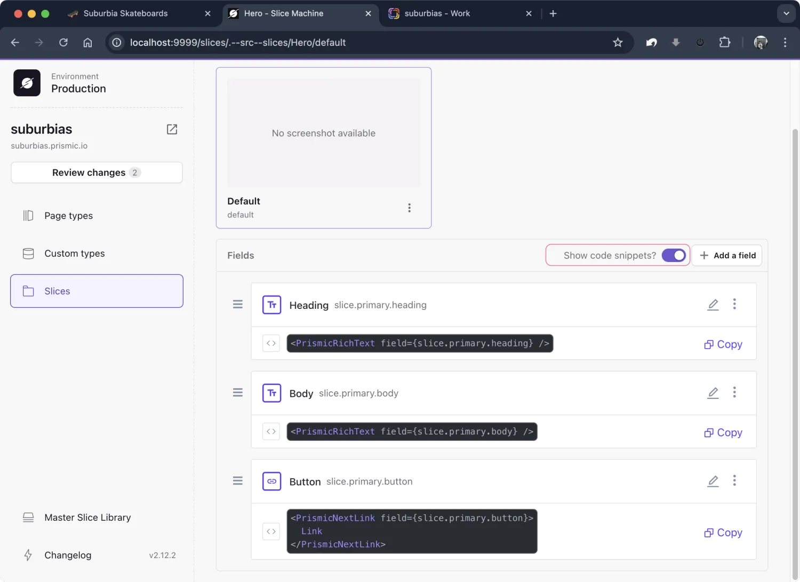

<details>
<summary>🟩 编辑 `src/slices/Hero/index.tsx` 文件：</summary>

```tsx
import type { Content } from '@prismicio/client'
import type { JSX } from 'react'
import { PrismicNextLink } from '@prismicio/next'
import { PrismicRichText, type SliceComponentProps } from '@prismicio/react'

/**
 * Props for `Hero`.
 */
export type HeroProps = SliceComponentProps<Content.HeroSlice>

/**
 * Component for "Hero" Slices.
 */
export default function Hero({ slice }: HeroProps): JSX.Element {
  return (
    <section
      data-slice-type={slice.slice_type}
      data-slice-variation={slice.variation}
    >
      <div className="text-red-700">
        <PrismicRichText field={slice.primary.heading} />
      </div>

      <PrismicRichText field={slice.primary.body} />
      <PrismicNextLink field={slice.primary.button}>
        Click
      </PrismicNextLink>
    </section>
  )
}
```

</details>

#### 3. 快速预览 （模拟）

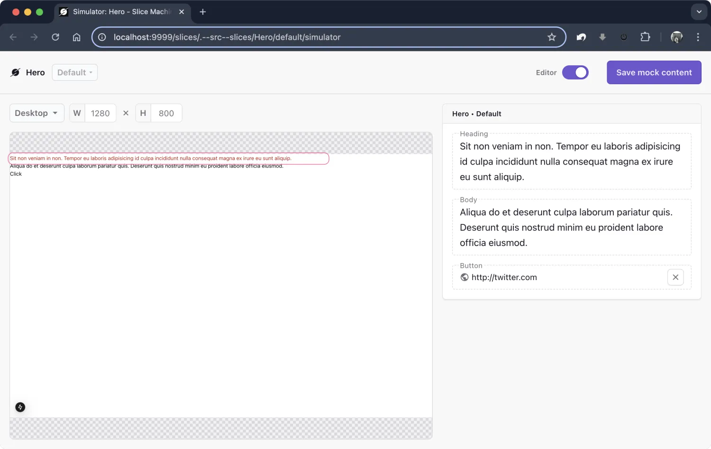

点击右上角 Simulate 按钮，可以快速预览样式

<details>
<summary>🟩 此时我们将页面 heading 设置为了红色，如果你发现样式并没有被添加，需要在 `tailwind.config.ts` 文件设置 `content` 包含 `./src/slices` 文件 </summary>

```ts
import type { Config } from 'tailwindcss'

export default {
  content: [
    './src/pages/**/*.{js,ts,jsx,tsx,mdx}',
    './src/components/**/*.{js,ts,jsx,tsx,mdx}',
    './src/app/**/*.{js,ts,jsx,tsx,mdx}',
    './src/slices/**/*.{js,ts,jsx,tsx,mdx}',
  ],
  // ...
} satisfies Config
```

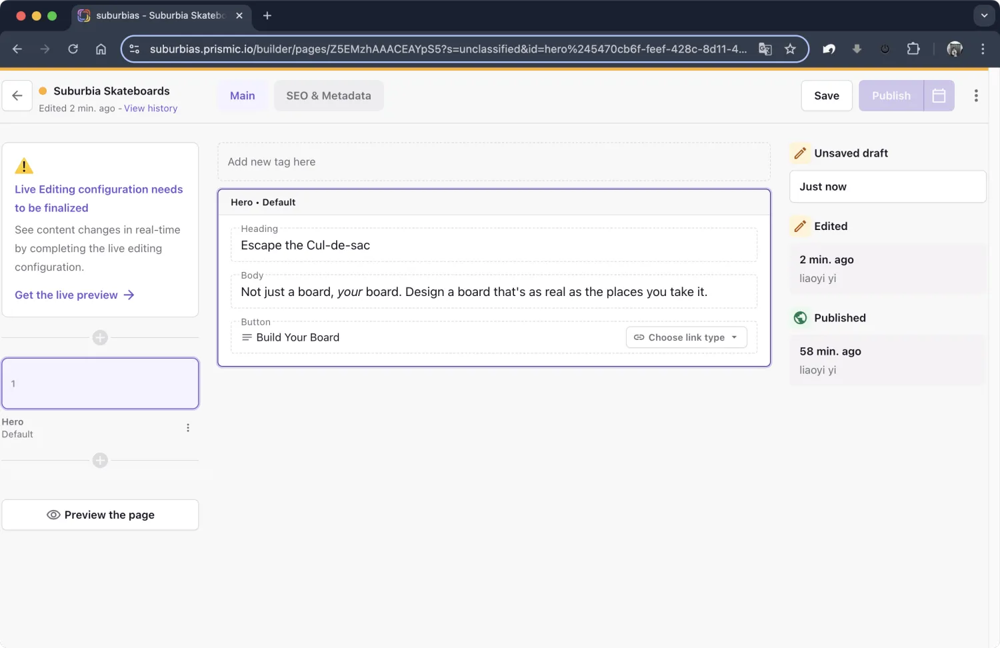
回到项目，刷新两次或三次页面，数据就能同步到本地项目了。

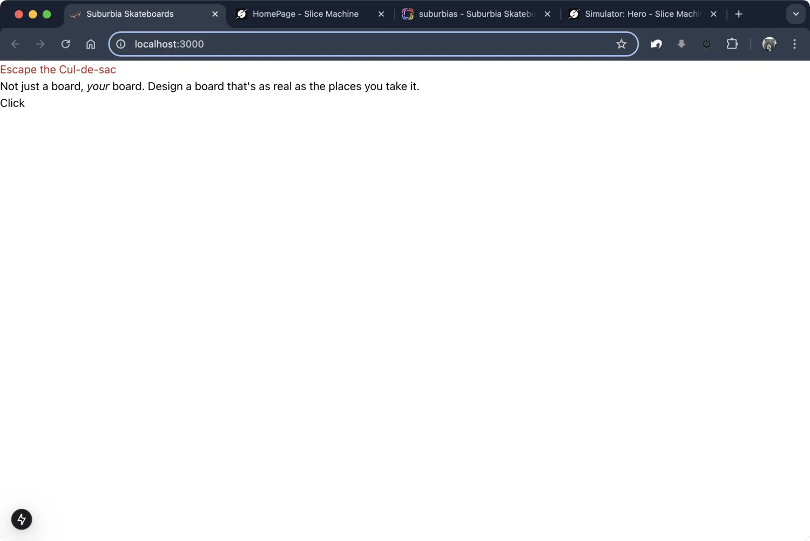

</details>

### 滑板定制页面

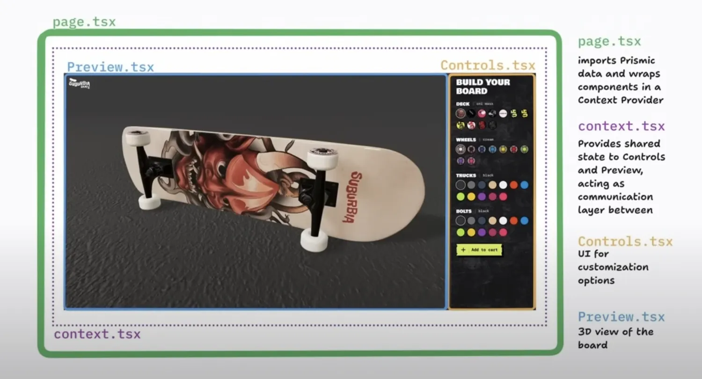
